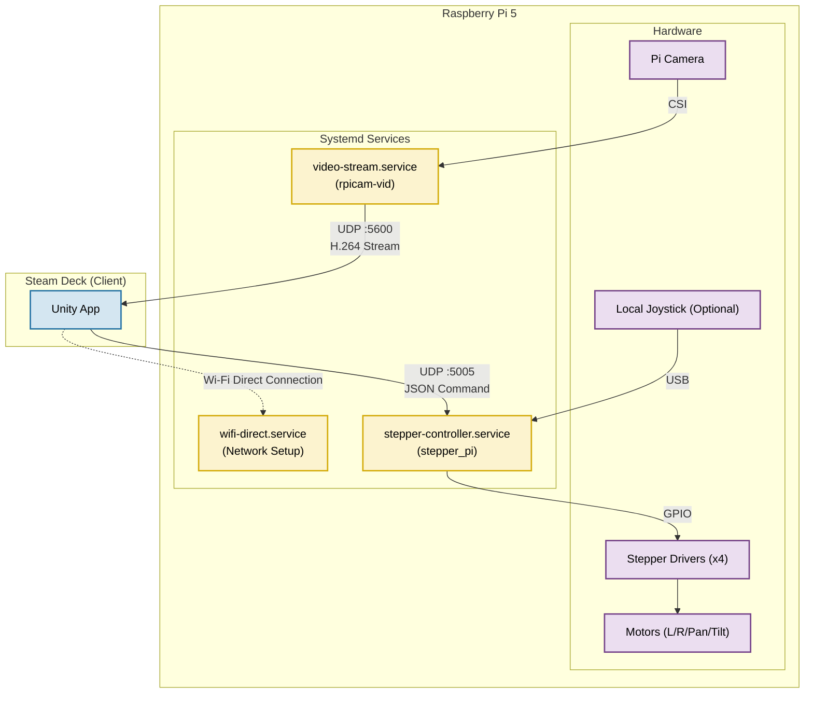

# Raspberry Pi Robot Controller

This project runs on a Raspberry Pi 5 to control a 4-axis robot (2 Drive Steppers + 2 Turret Steppers). It supports control via a local USB Joystick (Xbox controller) or via UDP network packets (e.g., from a Steam Deck over Wi-Fi Direct). It also streams low-latency H.264 video to the connected client.

## Features
*   **Motor Control**: Drives 4 stepper motors using `lgpio` for precise timing.
*   **Dual Input**: Seamlessly switches between local USB Joystick and Network UDP commands.
*   **Safety**: Auto-stops motors if network connection is lost for >1 second.
*   **Wi-Fi Direct**: Acts as a Group Owner (Hotspot) for easy field connection without a router.
*   **Video Streaming**: Low-latency hardware-accelerated streaming via `rpicam-vid`.
*   **Systemd Integration**: Auto-starts all services on boot.

## System Architecture


> Color key: **Blue**=Client, **Yellow**=Services, **Purple**=Hardware

<details>
<summary>Mermaid source</summary>
<!-- mermaid-output: assets/diagrams/architecture.png -->

</details>

## Hardware Pinout (BCM GPIO)

| Function | Enable | Direction | Pulse |
| :--- | :--- | :--- | :--- |
| **Left Drive** | 5 | 6 | 13 |
| **Right Drive** | 19 | 26 | 21 |
| **Turret Pan** | 23 | 24 | 25 |
| **Turret Tilt** | 12 | 16 | 20 |

*   **Activity LED**: GPIO 18

## 1. Base System Prep
- Flash Raspberry Pi OS (Bookworm or newer) to a microSD card and boot the Pi.
- Connect the Pi to the network and update the base image:
  ```bash
  sudo apt update
  sudo apt full-upgrade -y
  sudo reboot
  ```

## 2. Install Dependencies
Install the toolchain, libraries, and utilities:
```bash
sudo apt install -y build-essential cmake liblgpio-dev joystick git nlohmann-json3-dev dnsmasq psmisc
```
- `liblgpio-dev`: GPIO library for high-speed stepping.
- `nlohmann-json3-dev`: For parsing UDP JSON packets.
- `dnsmasq`: DHCP server for Wi-Fi Direct.

## 3. Build the Controller
The project uses CMake.

1.  Navigate to the `pi` directory:
    ```bash
    cd ~/Marp/Stepper/pi
    ```
2.  Create a build directory and compile:
    ```bash
    mkdir build && cd build
    cmake ..
    make
    ```
3.  The binary `stepper_pi` will be created in the `build` folder.

## 4. Installation (Auto-Start)
To set up Wi-Fi Direct, Video Streaming, and the Motor Controller to run automatically on boot:

1.  Run the installation script as root:
    ```bash
    cd ~/Marp/Stepper/pi/scripts
    chmod +x *.sh
    sudo ./install-services.sh
    ```
2.  This installs three systemd services:
    *   `wifi-direct.service`: Sets up the P2P network `DIRECT-xx-Robot-Pi5`.
    *   `stepper-controller.service`: Runs the robot logic.
    *   `video-stream.service`: Streams camera feed to the connected client.

## 5. Manual Usage
If you prefer to run things manually (e.g., for debugging):

**Start Wi-Fi Direct:**
```bash
sudo ./scripts/setup-wifi-direct.sh
```
*Connect your client (Steam Deck) to the SSID shown (e.g., `DIRECT-xx-Robot-Pi5`).*

**Start Motor Controller:**
```bash
sudo ./build/stepper_pi [optional_joystick_path]
```

**Start Video Stream:**
```bash
./scripts/start-video-stream.sh [CLIENT_IP]
```
*Defaults to `192.168.4.2`.*

## 6. Client Connection (Steam Deck / Unity)
*   **Network**: Connect to the Pi's Wi-Fi Direct network.
*   **UDP Control Port**: `5005` (Send JSON packets to `192.168.4.1`).
*   **Video Stream Port**: `5600` (Listen for raw H.264 UDP).

**JSON Packet Format:**
```json
{
  "joysticks": {
    "left": [x_float, y_float],   // Drive: -1.0 to 1.0
    "right": [x_float, y_float]  // Turret: -1.0 to 1.0
  }
}
```

## 7. Kinect Support with libfreenect
If you plan to steer the robot with a Kinect (RGB/depth, accelerometer, motor/LED control), the repository vendors [`OpenKinect/libfreenect`](https://github.com/OpenKinect/libfreenect) as a submodule.

1. **Sync the submodule**
  ```bash
  cd ~/Marp
  git submodule update --init --recursive Stepper/pi/libfreenect
  ```

2. **Install Kinect build prerequisites**
  ```bash
  sudo apt install -y libusb-1.0-0-dev freeglut3-dev mesa-utils python3
  ```

3. **Build libfreenect**
  ```bash
  cd ~/Marp/Stepper/pi/libfreenect
  mkdir -p build && cd build
  cmake -L .. -DBUILD_PYTHON3=ON
  make -j$(nproc)
  ```

## 8. Optional: VS Code Setup
To develop and debug directly on the Pi, install the official VS Code build for ARM:
```bash
sudo apt install -y curl gpg
sudo mkdir -p /etc/apt/keyrings
curl -fsSL https://packages.microsoft.com/keys/microsoft.asc | sudo gpg --dearmor -o /etc/apt/keyrings/packages.microsoft.gpg
echo "deb [arch=$(dpkg --print-architecture) signed-by=/etc/apt/keyrings/packages.microsoft.gpg] https://packages.microsoft.com/repos/code stable main" | sudo tee /etc/apt/sources.list.d/vscode.list > /dev/null
sudo apt update
sudo apt install -y code
```
