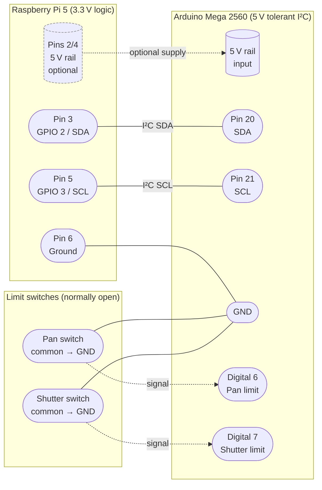

# I2C Bring-up Boilerplate

This folder packages an Arduino sketch and a Raspberry Pi helper script to smoke-test
the I²C link between the Raspberry Pi 5 compute core and the Arduino Mega
co-processor defined in the project plan.

The goal is to provide a repeatable loop for verifying wiring, firmware uploads,
and the basic command/telemetry protocol before integrating stepper drivers,
limit switches, or sensors.

## Contents

| Path | Purpose |
| --- | --- |
| `arduino/i2c_bridge_test.ino` | Arduino sketch that exposes a minimal I²C slave, heartbeat LED, and synthetic telemetry. |
| `pi/i2c_test.py` | Python CLI client (run on Raspberry Pi) that issues ping/telemetry commands using `smbus2`. |
| `pi/requirements.txt` | Python dependencies (`smbus2`). |

## Wiring Quick Reference

### Visual Pin Map


> Data flow color key

<details>
<summary>Mermaid source</summary>

<!-- mermaid-output: assets/diagrams/i2c-pin-map.png -->


> Use `npm run render:mermaid` (which calls `scripts/render-mermaid.ps1 -AllReadmes`) to regenerate all diagrams, or invoke the script manually for ad-hoc testing.

</details>

| Raspberry Pi 5 pin | Signal | Arduino Mega pin | Notes |
| --- | --- | --- | --- |
| Pin 3 (GPIO 2) | SDA | SDA (20) | Activate Pi I²C via `raspi-config` first. |
| Pin 5 (GPIO 3) | SCL | SCL (21) | Uses 3.3 V logic; Arduino Mega is 5 V tolerant on I²C. |
| Pin 6 | GND | GND | Common ground is required. |
| Optional | 5 V | 5 V | Power the Arduino from Pi only if current budget allows; otherwise keep isolated supplies. |

Limit switches for this test harness connect to:

- **Pan home switch:** Arduino digital pin 6 (normally-open, pulled up internally).
- **Shutter home switch:** Arduino digital pin 7 (normally-open, pulled up internally).

Leaving the switches disconnected will keep their state as "open" in telemetry.

## Step 1 – Flash the Arduino Sketch

1. Open `arduino/i2c_bridge_test.ino` in the Arduino IDE.
2. Select **Arduino Mega 2560** (or your board) and the correct serial port.
3. Upload the sketch. The built-in LED will blink once per second after boot.

### Sketch Behavior

- Listens as an I²C slave at address `0x08`.
- Toggles the built-in LED once per second to provide a heartbeat.
- Tracks two limit switch inputs (digital 6 and 7) and reports their active state.
- Supports three command IDs:
  - `0x01` – **Ping:** returns `"OK"`.
  - `0x02` – **Get telemetry:** returns 6 bytes described below.
  - `0x10` – **Set LED:** payload `0` = automatic blink, `1` = force off, `2` = force on.

### Telemetry Layout

| Byte offset | Field | Description |
| --- | --- | --- |
| 0 | Major version | Sketch major version (defaults to 1). |
| 1 | Minor version | Sketch minor version (defaults to 0). |
| 2–3 | Uptime (little-endian) | Seconds since boot, capped to 16 bits (rolls every ~18h). |
| 4 | Status flags | Bit 0: pan limit triggered; Bit 1: shutter limit triggered; Bit 7: LED currently on. |
| 5 | Heartbeat counter | Increments once per second. |

## Step 2 – Prepare the Raspberry Pi

```bash
sudo apt update
sudo apt install -y python3-pip python3-venv i2c-tools
python3 -m venv ~/i2c-test-env
source ~/i2c-test-env/bin/activate
pip install -r pi/requirements.txt
```

Enable I²C on the Pi (if not already done):

```bash
sudo raspi-config nonint do_i2c 0
sudo reboot
```

After reboot, confirm the Arduino appears on the bus:

```bash
sudo i2cdetect -y 1
```

The address `08` should appear in the grid.

## Step 3 – Exercise the Link

```bash
cd /path/to/Marp/i2c-test
python3 pi/i2c_test.py ping
python3 pi/i2c_test.py status
python3 pi/i2c_test.py watch --interval 2.0
python3 pi/i2c_test.py led on
```

Example output:

```
Ping response (2 bytes): OK
Firmware version  : 1.0
Uptime (s)        : 42
Pan limit switch  : open
Shutter limit     : TRIGGERED
Status LED        : ON
Heartbeat counter : 42
```

Use `Ctrl+C` to exit the `watch` command. Changing the LED mode lets you confirm
write transactions.

## Troubleshooting Tips

- **ImportError: smbus2** &rarr; Activate your Python virtual environment or install dependencies.
- **OSError: [Errno 121] Remote I/O error** &rarr; Check SDA/SCL wiring, ensure the Arduino sketch is flashed, and verify the address matches (`--address 0x08`).
- **Limit switches always read triggered** &rarr; Confirm the normally-open switches use the Arduino internal pull-ups (wiring to GND when closed).
- **Need more telemetry fields?** Extend `TelemetryPacket` in the sketch and update the layout table and Python `Telemetry.from_bytes` method.

## Next Steps

- Add command IDs for stepper driver enable/disable once drivers are wired.
- Expand telemetry with motor current sensing, LiDAR presence, or fuse health as hardware becomes available.
- Mirror these commands in the eventual ROS / control stack once the protocol stabilizes.
