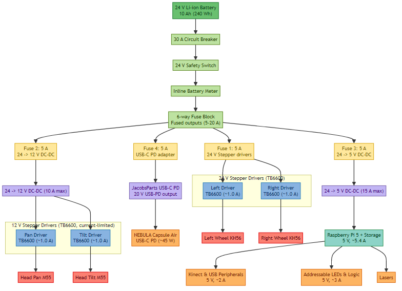
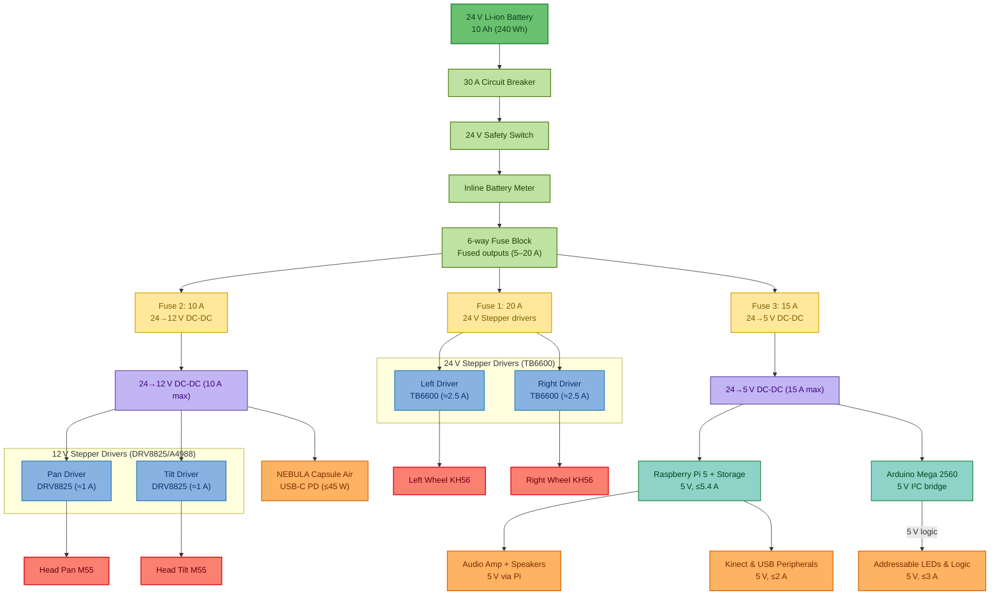
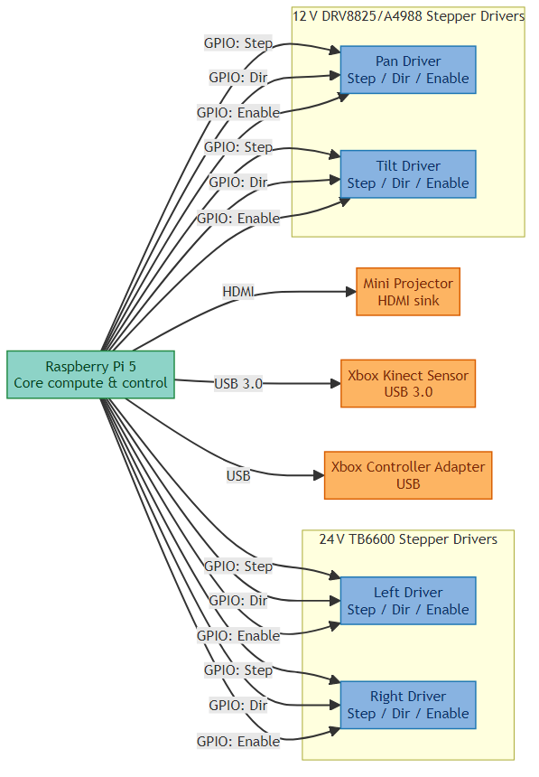
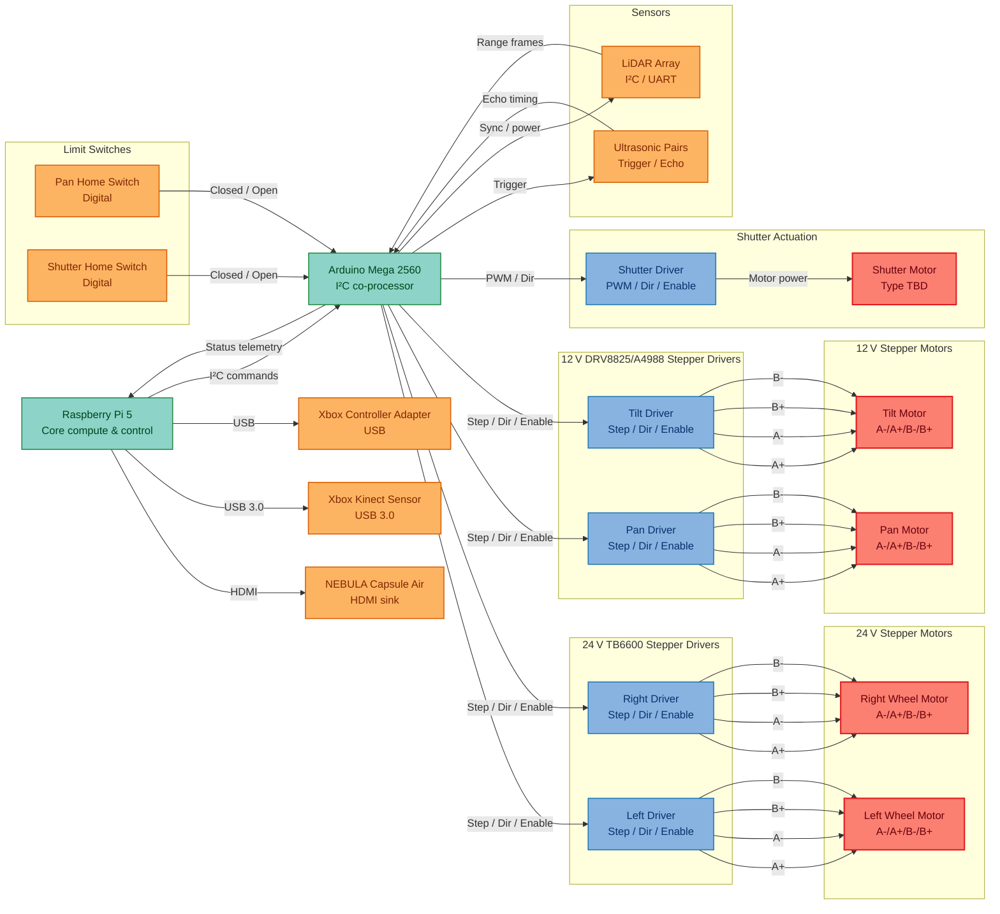

# Marp

## Overview
| Aspect | Details |
| --- | --- |
| Mission | Home robot emphasizing modular hardware and intuitive control via Xbox gamepad. |
| Current Focus | Documenting component selections, integration needs, and outstanding research items. |
| Development Notes | Prioritize maintainable wiring, accessible diagnostics, and future sensor expansion. |

### High-Level Wiring Diagram

> Color key: power distribution (green hues), individual fuses (yellow), drivers (blue), converters (lavender), compute core (teal), peripherals (orange), and motors (red).

Mermaid source

> Rendered with `scripts/render-mermaid.ps1` (`npm run render:mermaid`). Run the script after editing the Mermaid source below to refresh the image.

### Data Flow Diagram

> Data flow color key: compute (teal), peripherals (orange), drivers (blue), motors (red).

Mermaid source

> Rendered with `scripts/render-mermaid.ps1 -DiagramIndex 1 -OutputPath assets/diagrams/data-flow.png`. Run the script after editing the Mermaid source below to refresh the image.

## Control & Compute
| Component | Role | Voltage (V) | Amperage (A) | Wattage (W) | Physical Dimensions (") | Link | Notes |
| --- | --- | --- | --- | --- | --- | --- | --- |
| Controller | Primary operator input | 5 | ≤1.5 | ≤7.5 | Gamepad form factor | [Xbox Elite Controller](https://www.xbox.com/en-US/accessories/controllers/elite-wireless-controller-series-2) | Wireless or USB |
| Computer | Onboard coordination & processing | 5 | ≤5.4 | ≤27 | 3.35" × 2.20" × 0.71" | [Raspberry Pi 5](https://www.raspberrypi.com/products/raspberry-pi-5/) | Wi-Fi / Bluetooth / USB; CSI/DSI; 16 GB RAM, 64 GB SD. |
| Microcontroller | Motion & sensor co-processor | 5 | ≤0.5 | ≤2.5 | 4.00" × 2.10" × 0.60" | [Arduino Mega 2560](https://store.arduino.cc/products/arduino-mega-2560-rev3) | I²C bridge coordinating drivers, sensors, and limit switches. |

## Locomotion
| Component | Voltage (V) | Amperage (A) | Wattage (W) | Physical Dimensions (") | Link | Notes |
| --- | --- | --- | --- | --- | --- | --- |
| Left wheel | 24 | 2.5 | 60 | 2.20" | [Nidec](https://www.nidec-advancedmotor.com/en/digital/pdf/KH56Q.pdf) | KH56 Stepper Motor |
| Right wheel | 24 | 2.5 | 60 | 2.20" | [Nidec](https://www.nidec-advancedmotor.com/en/digital/pdf/KH56Q.pdf) | KH56 Stepper Motor |
| Drivers | 24 | ≤2.5 | ≤120 | 3.4" × 1.8" × 1.3" | [Makerguides](https://www.makerguides.com/tb6600-stepper-motor-driver-arduino-tutorial/) | TB6600 × 2 |

## Actuation

| Component | Voltage (V) | Amperage (A) | Wattage (W) | Physical Dimensions (") | Link | Notes |
| --- | --- | --- | --- | --- | --- | --- |
| Head pan | 12 | 1.0 | 12 | Ø2.17" × 0.98" | [Mitsumi](https://product.minebeamitsumi.com/en/product/category/rotary/steppingmotor/pm/PMStandardtype.html) | M55SP-3NK Stepper Motor (stocked on [Radwell](https://www.radwell.com/Buy/MITSUMI/MITSUMI/M55SP-2NK)) |
| Head tilt | 12 | 1.0 | 12 | Ø2.17" × 0.98" | [Mitsumi](https://product.minebeamitsumi.com/en/product/category/rotary/steppingmotor/pm/PMStandardtype.html) | M55SP-3NK Stepper Motor (stocked on [Radwell](https://www.radwell.com/Buy/MITSUMI/MITSUMI/M55SP-2NK)) |
| Drivers | 12 | ≤2.0 | ≤24 | 0.8" × 0.6" | [Jeanoko](https://www.amazon.com/dp/B0C4P8997M) | DRV8825/A4988 × 2 |
| Shutter motor driver | TBD | TBD | TBD | TBD | — | H-bridge driver; 5 V logic with 12 V motor rail; commanded by Arduino. |
| Shutter motor | TBD | TBD | TBD | TBD | — | Motorized projector shutter (non-stepper); homed via limit switch. |

## Power & Electronics
| Component | Voltage (V) | Amperage (A) | Wattage (W) | Physical Dimensions (") | Link | Notes |
| --- | --- | --- | --- | --- | --- | --- |
| Lithium Battery | 24 | 5 (Continuous), 10 (Peak) | 240 Wh | 5.8" × 3.2" × 2.8" | [Aegis](https://www.aegisbattery.com/collections/24v-lithium-batteries/products/aegis-24v-10ah-lithium-ion-battery-pack-nmc-24v-lithium-battery) | 10 Ah NMC pack (≈240 Wh capacity). |
| Battery Meter | 24 | ≤0.5 | ≤1.2 | 85mm x W: 42mm x H: 25mm | [Aegis](https://www.aegisbattery.com/collections/lithium-battery-meters-instruments/products/high-precision-battery-200a-watt-meter-and-power-analyzer) | Inline 200 A analyzer (voltage, amps, watts). |
| Anderson PP45 → ring adapter | 24 | 20 | 480 | M10 ring | [Aegis](https://www.aegisbattery.com/collections/adapters/products/anderson-to-ring-terminal-adapter) | Quick battery-to-system interface. |
| Circuit Breaker | 24 | 30 | 720 | 1.73"D x 1.93"W x 2.91"H | [Hamolar](https://www.amazon.com/gp/product/B095Z2F5F7/ref=ewc_pr_img_2?smid=A2TJVE0ZQTOQDP&th=1) | Main battery protection. |
| Safety Switch | 24 | 16 | 384 | 4.88 x 2.24 x 2.09 | [Vonvoff](https://www.amazon.com/dp/B0CKXPNBB2?ref=ppx_yo2ov_dt_b_fed_asin_title&th=1) | Manual 24 V disconnect. |
| Fuse Block | 24 | 5–20 (per branch) | ≤640 (aggregate) | 3.66" × 1.77" × 4.88" | [Tutooper](https://www.amazon.com/gp/product/B0F4NJK6MZ/ref=ewc_pr_img_1?smid=AAWQNNL1TJNS4&th=1) | Six-position low-voltage distribution. |
| 12 V Converter | 24→12 | 10 | 120 | 2.04"D x 1.88"W x 0.74"H | [Tobsun](https://www.amazon.com/gp/product/B07V6X6L89/ref=ewc_pr_img_1?smid=A3GYM455B71YGR&th=1) | DC-DC buck for 12 V peripherals. |
| 5 V Converter | 24→5 | 15 | 75 | 0.71"D x 1.26"W x 0.71"H | [Tobsun](https://www.amazon.com/dp/B0BLSGDVHF?ref=ppx_yo2ov_dt_b_fed_asin_title) | DC-DC buck for logic and compute loads. |

## Sensors & Outputs

### Distance & Environment
| Sensor | Range / Resolution | Coverage | Voltage (V) | Amperage (A) | Wattage (W) | Physical Dimensions (") | Link | Notes |
| --- | --- | --- | --- | --- | --- | --- | --- | --- |
| Ultrasonic pair (x2 sets) | Short-range (TBD) | Front/Rear or side placements TBD | 5 | ≤0.015 | ≤0.075 | ~1.77" × 0.79" modules | — | Use overlapping fields to reduce blind spots; polled by Arduino over I²C link to Pi. |
| Single-direction LiDARs (~10) | Spec TBD | 360° array via multiple units | TBD | TBD | TBD | TBD | — | Define spacing and mounting for uniform perimeter sensing; prefer I²C/RS485 variants managed by Arduino. |

### Contact & Limit Sensing

| Component | Role | Voltage (V) | Amperage (A) | Wattage (W) | Physical Dimensions (") | Link | Notes |
| --- | --- | --- | --- | --- | --- | --- | --- |
| Pan home limit switch | Homing reference for head pan axis | 5 | ≤0.02 | ≤0.1 | TBD | — | Wired to Arduino digital input with pull-up; defines zero position. |
| Shutter home limit switch | Homing reference for projector shutter | 5 | ≤0.02 | ≤0.1 | TBD | — | Confirms shutter closed position; debounced on Arduino. |

### Vision & Interaction
| Component | Function | Coverage / Resolution | Voltage (V) | Amperage (A) | Wattage (W) | Physical Dimensions (") | Link | Notes |
| --- | --- | --- | --- | --- | --- | --- | --- | --- |
| Xbox Kinect | Depth + RGB sensing, Pose detection | Wide FoV; structured light | 5 | ≤2 | ≤10 | 11" × 2.6" × 1.5" | [OpenKinect](https://github.com/OpenKinect/libfreenect) | Confirm Raspberry Pi compatibility or plan for companion compute. |
| Mini Projector | Visual output | 720p (150 ANSI) | 5–20 (USB-C PD) | ≤2.25 | ≤45 | Ø2.7" × 5.5" | [NEBULA Capsule Air](https://www.amazon.com/dp/B0CWV1S7B4?ref=ppx_yo2ov_dt_b_fed_asin_title&th=1) | Built-in 34 Wh battery; integrate 45 W USB-C PD or leverage internal pack. |
| Camera | Vision input | 12 MP, 75° FoV; autofocus | 5 | ≤0.5 | ≤2.5 | 1.50" × 1.50" × 0.71" (w/ adapter) | [Arducam](https://www.amazon.com/dp/B0C9PYCV9S?ref=ppx_yo2ov_dt_b_fed_asin_title) | IMX708 |
| Addressable LED strip | Face ring | Pixel count TBD | 5 | ≤0.06 (per LED) | ≤0.3 (per 5 LEDs) | Flexible strip | — | Level-shift 3.3 V logic up to 5 V. |

### Audio
| Component | Role | Voltage (V) | Amperage (A) | Wattage (W) | Physical Dimensions (") | Link | Notes |
| --- | --- | --- | --- | --- | --- | --- | --- |
| Left speaker | Stereo output | TBD (per amplifier) | TBD | TBD | TBD | — | Powered via amplifier module (TBD). |
| Right speaker | Stereo output | TBD (per amplifier) | TBD | TBD | TBD | — | Match impedance with amplifier selection. |

## Open Items
| Item | Status | Next Step |
| --- | --- | --- |
| Head stepper motor selection | Pending | Determine torque requirements and mechanical constraints. |
| Projector specification | Selected | Locked on NEBULA Capsule Air (720p, 150 ANSI); confirm PD power profile. |
| Sensor placement plan | Pending | Draft layout for ultrasonic and LiDAR modules; validate wiring paths. |
| Power budget verification | Pending | Sum draw across motors, compute, sensors, and converters; size fuses accordingly. |
| Projector integration | In progress | Design mount plus USB-C PD (45 W) power delivery and verify HDMI link to Pi 5. |
| Arduino firmware architecture | Pending | Define I²C command protocol between Pi and Arduino; map driver and sensor update loops. |
| Shutter motor/driver selection | Pending | Choose H-bridge module and projector shutter motor torque requirements. |
| Limit switch hardware | Pending | Select housing and lever style for pan/shutter homing switches; confirm wiring strain relief. |

## I/O & Pin Planning
| Device / Bus | Qty | Pins (each) | Total Pins | Notes |
| --- | --- | --- | --- | --- |
| Arduino co-processor | 1 | SDA, SCL (2) | 2 | I²C link from Raspberry Pi to Arduino Mega for motion & sensor fan-out. |
| 24 V stepper drivers (L/R) | 2 | Step, Dir, Enable (3) | 6 | TB6600 opto-isolated inputs; commanded by Arduino, enable optionally shared. |
| 12 V stepper drivers (pan/tilt) | 2 | Step, Dir, Enable (3) | 6 | Routed through Arduino; reserve extra GPIO for future torque/sense lines. |
| Shutter motor driver | 1 | PWM, Dir, Enable (3) | 3 | H-bridge signals generated by Arduino (hardware PWM). |
| Ultrasonic modules | 2 | Trigger, Echo (2) | 4 | HC-SR04-compatible; trigger/echo timing handled on Arduino. |
| LiDAR modules | ~10 | I²C (shared 2) or UART (2 each) | 2–20 | Prefer shared-bus variants aggregated via Arduino to save Pi GPIO. |
| Xbox Kinect | 1 | USB | 0 | Draws only from USB bus. |
| Addressable LED strip | 1 | Data (1) | 1 | Level-shift 3.3 V logic up to 5 V. |
| Limit switches | 2 | Signal (1) | 2 | Home switches read by Arduino with internal pull-ups. |
| Audio amp control | 1 | Enable / I²C | 1–2 | Depends on module selection; tie into Arduino or Pi as needed. |
| Budget margin | — | — | ≥4 | Hold for future peripherals. |

### Pin mitigation options
- Offload high-rate GPIO to a microcontroller (e.g., RP2040, Arduino) and bridge via USB/UART.
- Add I²C GPIO expanders (MCP23017, TCA9548A) or SPI shift registers for sensor triggering.
- Share enable signals across compatible stepper drivers or use differential buses for LiDAR arrays.

